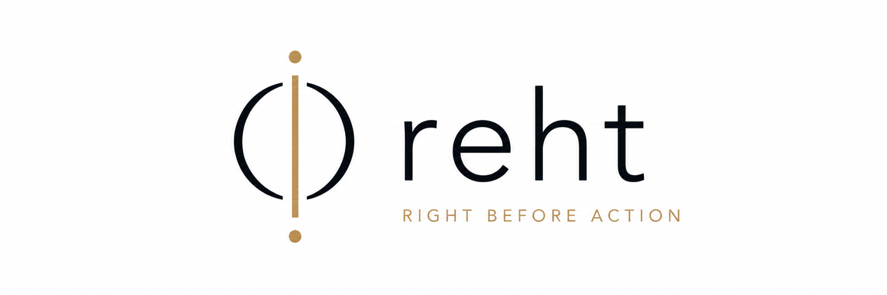

<div align="center">



# reht standard

**A public standard for governed AI-mediated actions before execution.**

[](CHANGELOG.md)
[](SPECIFICATION.md)
[](LICENSE)
[](schemas/)
[](.github/workflows/)
[](docs/BOUNDARIES.md)
[](SPECIFICATION.md)

---

**Reasoning may be probabilistic. Execution authority must be governed.**

> Is this action admissible to execute in the present governed state?

</div>

---

## 1. Overview

reht is a public standard that defines the language and contracts used to decide whether a specific action, proposed by an AI system or any autonomous process, is admissible to execute at a specific moment under a specific governed state.

It is not a model. It is not an agent. It is not a policy engine. It is the interoperable contract layer that sits between reasoning and execution, so that any actor, evaluator, executor or auditor can speak the same language about a single question:

> Is this action admissible to execute in the present governed state?

The standard is model agnostic, vendor neutral and implementation independent.

It is also explicitly anti-lock-in:

> **VALO and reht must not create agent, model or infrastructure lock-in. Policies, authority definitions, workflows, receipts and learned methods must remain portable and independently verifiable.**

Models, agents, tools, runtimes and infrastructure providers may change. The governed meaning of authority, evidence, policy, workflow state and execution controls must survive those substitutions.

## 2. The missing layer

Modern systems already answer two questions well:

- **Identity** answers *who is acting*.
- **Authorization** answers *what the actor may do* in general.

Neither of these answers the operational question that governs autonomous execution:

- **reht** asks *whether this specific action is admissible now*, given current authority, evidence, policy, governance state and delegation.

Identity and authorization describe standing capability. reht describes situated admissibility at the moment of execution. Without this layer, autonomous systems cross the execution boundary based on probabilistic reasoning alone.

## 3. Architecture

```
Reality
   ↓
Observation
   ↓
Evaluation
   ↓
reht admissibility
   ↓
Execution boundary
   ↓
Receipt
```

reht occupies the position immediately before the execution boundary. Everything upstream is reasoning about the world. Everything downstream is an accountable effect on the world. The admissibility decision is the governed transition between the two.

### 3.1 Portability and neutral infrastructure

A conforming architecture should preserve the governed contracts when any surrounding component is replaced.

This includes migration between:

- foundation models and model providers;
- internal and external agents;
- MCP, A2A and future interoperability environments;
- local, edge, sovereign and cloud infrastructure;
- workflow engines and tool ecosystems;
- storage, memory and context implementations.

Portability does not mean that all implementations must disclose proprietary evaluation logic. It means that the inputs, authority definitions, policy references, workflow state, evidence bindings, decisions and receipts required to reconstruct and independently verify the governed action must not be trapped inside one vendor-specific runtime.

**Models and agents may change. Authority, evidence and execution controls must remain portable.**

## 4. Public contracts

The standard defines a small set of stable, versioned contracts. Each has a JSON Schema in [`schemas/`](schemas/) and a normative description in [`SPECIFICATION.md`](SPECIFICATION.md).

| Contract | Purpose |
| --- | --- |
| **Action Envelope** | The proposed action, its parameters and its intended effect. |
| **Authority Context** | The standing authority under which the actor operates. |
| **Evidence Package** | The observations and attestations relied on for the decision. |
| **Policy Context** | The policies in force at the moment of evaluation. |
| **Governance State** | The current governed state of the system and its constraints. |
| **Delegation Chain** | The traceable chain of delegated authority behind the actor. |
| **Admissibility Result** | The outcome, its rationale and the inputs it was computed over. |
| **Continuous Integrity Event** | State transitions that may invalidate a prior admissibility. |
| **Execution Receipt** | The post-execution record bound to the admissibility decision. |

## 5. Admissibility outcomes

An admissibility evaluation returns exactly one outcome:

- `ADMISSIBLE`
- `INADMISSIBLE`
- `INDETERMINATE`
- `REQUIRES_STEP_UP`
- `NO_LONGER_ADMISSIBLE`

> These are admissibility outcomes, not execution commands. An `ADMISSIBLE` result authorizes an executor to proceed within the governed boundary. It does not itself perform the action.

## 6. How it works

1. An actor proposes an action as an **Action Envelope**.
2. Supporting **Authority Context**, **Evidence Package**, **Policy Context**, **Governance State** and **Delegation Chain** are assembled.
3. An evaluator computes an **Admissibility Result** against these inputs.
4. If admissible, the executor may cross the execution boundary and produce an **Execution Receipt** bound to the decision.
5. **Continuous Integrity Events** may downgrade a prior decision to `NO_LONGER_ADMISSIBLE` before or during execution.

## 7. Start here

- Read the specification: [`SPECIFICATION.md`](SPECIFICATION.md)
- Review the execution boundary: [`docs/BOUNDARIES.md`](docs/BOUNDARIES.md)
- Read the threat model: [`docs/THREAT_MODEL.md`](docs/THREAT_MODEL.md)
- Inspect the schemas: [`schemas/`](schemas/)
- Explore reference payloads: [`examples/`](examples/)
- Check conformance requirements: [`CONFORMANCE.md`](CONFORMANCE.md)

## 8. Repository structure

```
.
├── SPECIFICATION.md         Normative specification
├── CONFORMANCE.md           Conformance requirements
├── TRADEMARKS.md            Trademark and naming policy
├── CHANGELOG.md             Versioned changes
├── CONTRIBUTING.md          Contribution process
├── SECURITY.md              Security disclosure policy
├── NOTICE                   Attribution notices
├── LICENSE                  Apache License 2.0
├── docs/
│   ├── BOUNDARIES.md        Execution boundary definition
│   ├── THREAT_MODEL.md      Threat model
│   └── VERSIONING.md        Versioning policy
├── schemas/                 JSON Schema 2020-12 contracts
└── examples/                Reference payloads
```

## 9. Conformance

Conformance is defined in [`CONFORMANCE.md`](CONFORMANCE.md). Implementations are evaluated against the published schemas and the normative requirements of the specification. Schema validation is a necessary but not sufficient condition for conformance. Continuous integration in this repository validates all schemas and reference examples using GitHub Actions.

## 10. Trademark and compatibility rules

See [`TRADEMARKS.md`](TRADEMARKS.md) for the authoritative policy. In summary:

- The Apache License 2.0 covers the code, schemas and examples in this repository.
- The license does not grant any rights til the **reht** or **VALO** names, logos or marks.
- Forks and derivatives may not present themselves as the official standard or as an official reht release.
- **reht-compatible** is a descriptive claim that an implementation follows the public contracts.
- **reht-conformant** requires meeting the published requirements in [`CONFORMANCE.md`](CONFORMANCE.md).
- **reht-certified** is reserved for an official certification program and may not be used otherwise.
- Passing schema validation does not imply certification, conformance or endorsement.

## 11. What this repository does not contain

| This repository is | This repository is not |
| --- | --- |
| A public specification | The private reht runtime |
| A shared vocabulary | Proprietary evaluation logic |
| A set of interoperable JSON schemas | A model or an agent |
| A conformance surface | A policy engine |
| A public execution-governance contract | A certification |
|  | A regulatory compliance guarantee |

## 12. Versioning

The standard follows the versioning policy in [`docs/VERSIONING.md`](docs/VERSIONING.md). Changes are recorded in [`CHANGELOG.md`](CHANGELOG.md). The current status is **draft v0.1**; contracts may evolve prior to a stable v1.0.

## 13. Security

Security policy and coordinated disclosure are described in [`SECURITY.md`](SECURITY.md). The threat model is maintained in [`docs/THREAT_MODEL.md`](docs/THREAT_MODEL.md). Do not report vulnerabilities in public issues.

## 14. Contributing

Contributions are welcome under the process defined in [`CONTRIBUTING.md`](CONTRIBUTING.md). Proposals that affect normative contracts require a specification change and a corresponding schema update.

## 15. License

Released under the Apache License 2.0. See [`LICENSE`](LICENSE) and [`NOTICE`](NOTICE). Trademark rights are governed separately by [`TRADEMARKS.md`](TRADEMARKS.md).
