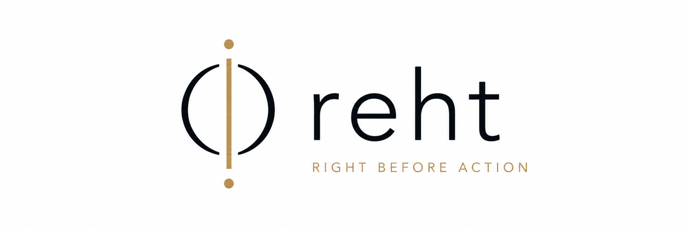

<div align="center">



# reht standard

**Public-release candidate for governed AI-mediated actions before execution.**

> **Hosting status — 2026-08-14:** this GitHub repository is currently **private**. The specification is intended for public release under Apache License 2.0, but it MUST NOT be described as publicly accessible until repository visibility is actually changed. See [PUBLICATION_STATUS.md](PUBLICATION_STATUS.md).

[](CHANGELOG.md)
[](PUBLICATION_STATUS.md)
[](LICENSE)
[](schemas/)
[](.github/workflows/)
[](docs/BOUNDARIES.md)
[](SPECIFICATION.md)

---

**Reasoning may be probabilistic. Execution authority must be governed.**

> Is this still the thing that was approved?

</div>

---

## 0. Canonical contract reference

**reht-standard is canonical ONLY for REHT-specific clearance and authorization standards.**
Runtime execution-governance contracts are defined by **RACS/spec** and MUST be referenced, not duplicated. See [CANONICAL.md](CANONICAL.md).

REHT-specific standard semantics live here. The canonical VALO runtime authorization implementation is owned separately and publication of this repository does not transfer runtime ownership.

## 1. Overview

reht is intended as a public, model-agnostic standard for deciding whether a specific action is admissible at the execution boundary under current authority, evidence, policy and governed state. The current repository hosting remains private until the public-release gate in `PUBLICATION_STATUS.md` is completed.

It is not a model, agent or policy engine. It is an interoperable standards/conformance layer between reasoning and consequence.

The central execution invariant is:

> **Authorization is not a durable truth. At execution, the system must prove that this is still the thing that was approved.**

A prior admissibility result does not remain executable merely because a wall-clock interval has not expired. Where evaluation and execution are separated, the executor must independently re-establish the execution-relevant action, authority and governed state and fail closed if continuity cannot be proven.

The standard is vendor neutral, implementation independent and explicitly anti-lock-in.

## 2. The missing layer

Modern systems already answer two questions well:

- **Identity** answers *who is acting*.
- **Authorization** answers *what the actor may do* in general.

REHT asks the operational question that matters at consequence:

- **Is this exact action still admissible to execute now, under the state and authority that actually exist at execution?**

That distinction prevents a prior verdict, batch approval, grant or capability from becoming a bearer token whose meaning silently survives state drift.

## 3. Architecture

```text
Reality
   ↓
Observation
   ↓
Evaluation
   ↓
REHT admissibility
   ↓
Causal execution continuity
   ↓
Execution boundary
   ↓
Receipt
```

This is a standards-level conceptual flow, not a replacement for the canonical VALO runtime component map.

### 3.1 Portability and neutral infrastructure

Models, agents, tools, runtimes and infrastructure providers may change. The governed meaning of authority, evidence, policy, workflow state and execution controls must survive those substitutions.

External identity, authority, evidence, capability or runtime systems may bind into REHT without becoming required REHT dependencies.

### 3.2 Provenance and expectation integrity

AI-content and origin detectors may contribute evidence, but they do not establish authorship, intent, deception, accountable judgment or execution authority. See [`docs/CLAUDEFISHING_PROVENANCE.md`](docs/CLAUDEFISHING_PROVENANCE.md).

### 3.3 Causal execution continuity

Across independently owned systems, wall-clock time is not the authoritative primitive for proving that a prior authorization still applies.

REHT instead requires causal continuity: the executor must be able to show that the action, authority and execution-relevant governed state are still the ones that were evaluated, and that no disqualifying event has intervened.

The first conformance vector covers:

- drift;
- expired scope;
- broken receipt continuity;
- stale authority;
- replay.

See [`docs/CAUSAL_EXECUTION_CONTINUITY.md`](docs/CAUSAL_EXECUTION_CONTINUITY.md) and [`conformance/causal-execution-v0.2.json`](conformance/causal-execution-v0.2.json).

## 4. Release-candidate contracts

The standard defines contracts and conformance semantics intended for public release for:

- Action Envelope;
- Authority Context;
- Evidence Package;
- Policy Context;
- Governance State;
- Delegation Chain;
- Admissibility Result;
- Continuous Integrity Event;
- Execution Receipt;
- Causal Execution Continuity.

## 5. Admissibility outcomes

An admissibility evaluation returns exactly one outcome:

- `ADMISSIBLE`
- `INADMISSIBLE`
- `INDETERMINATE`
- `REQUIRES_STEP_UP`
- `NO_LONGER_ADMISSIBLE`

These are semantic outcomes, not execution commands.

A successful execution-envelope comparison does not force `ADMISSIBLE`. It only establishes that the executor is still evaluating the action and state that were bound to the prior result.

## 6. How it works

1. An actor proposes an action as an Action Envelope.
2. Authority, evidence, policy and governed-state context are assembled.
3. An evaluator computes an Admissibility Result.
4. If evaluation and execution are separated, the result is bound to a deterministic execution envelope.
5. Immediately before consequence, the executor independently re-derives the execution-relevant envelope and causal lineage.
6. Any material mismatch, stale authority, replay, broken required continuity or invalid scope is non-executable.
7. A matching binding permits REHT evaluation to continue; REHT retains final clearance semantics.
8. Execution produces a receipt bound to the governed decision and relevant continuity evidence.

## 7. Time semantics

Existing time fields such as `timestamp`, `observed_at`, `evaluated_at`, `valid_from`, `valid_until` and `expires_at` remain useful for policy, scope, audit, correlation and forensics.

They are not sufficient proof that a prior admissibility remains executable across independently owned systems.

## 8. Start here

- [`PUBLICATION_STATUS.md`](PUBLICATION_STATUS.md) — actual hosting/publication state and release gate
- [`SPECIFICATION.md`](SPECIFICATION.md) — normative specification
- [`CONFORMANCE.md`](CONFORMANCE.md) — conformance requirements
- [`docs/CAUSAL_EXECUTION_CONTINUITY.md`](docs/CAUSAL_EXECUTION_CONTINUITY.md) — causal execution profile
- [`conformance/causal-execution-v0.2.json`](conformance/causal-execution-v0.2.json) — machine-readable first vector
- [`docs/BOUNDARIES.md`](docs/BOUNDARIES.md) — publication boundary
- [`docs/THREAT_MODEL.md`](docs/THREAT_MODEL.md) — threat model
- [`CANONICAL.md`](CANONICAL.md) — REHT/RACS standards ownership

## 9. Conformance

Schema validation is necessary but not sufficient. REHT conformance includes semantic refusal behavior at the execution boundary.

The first causal execution vector requires one positive control and five negative cases. An implementation that accepts the happy path but fails to reject drift, invalid scope, broken required continuity, stale authority or replay is not conformant to that profile.

## 10. Independence

REHT does not require any specific identity, authority, evidence, runtime, capability, receipt or causal-time implementation.

A third-party system may map its own binding reference into the REHT execution boundary while retaining independent ownership of its architecture, release cycle and IP.

## 11. What this repository does not contain

This repository is a public-release candidate specification and conformance surface. It does not contain VALO production runtime code, proprietary evaluation logic, customer integrations, internal thresholds, deployment configuration or a certification program.

Private hosting does not change the intended licensing of the content, and licensing does not make the repository publicly accessible by itself.

## 12. Versioning

Current status: **draft v0.2 / public-release candidate**.

The v0.2 draft introduces causal execution-validity semantics while retaining existing v0.1 time fields for compatibility. Canonical RACS-owned runtime schema changes must be made in RACS/spec and referenced here rather than duplicated.

## 13. Security

See [`SECURITY.md`](SECURITY.md) and [`docs/THREAT_MODEL.md`](docs/THREAT_MODEL.md).

## 14. Contributing

See [`CONTRIBUTING.md`](CONTRIBUTING.md). Normative changes require rationale, compatibility impact, security impact and migration notes where applicable.

External contribution is practically available only after the repository is made public or contributors are explicitly granted repository access.

## 15. License

The repository content is licensed under the Apache License 2.0. See [`LICENSE`](LICENSE), [`NOTICE`](NOTICE) and [`TRADEMARKS.md`](TRADEMARKS.md).

License terms and repository visibility are independent: as of 2026-08-14 the GitHub repository remains private.
